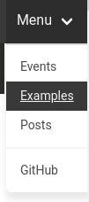

### Relevant files

1. config.toml




1. /layouts/partials/header/nav-menu.html




---

### Breaking things down

#### Section Menu for Lazy Bloggers 

There are several ways to create menus in Hugo. The simplest one involves simply adding one line in our config:

```toml
sectionPagesMenu = "main"
```

The Relevant File #2 contains the code snippet that prints out the actual menu entries.

You can see this in action on the top nav bar:



Accessing the menu from this page, we see the Examples entry is highlighted. This happens because `$currentPage.HasMenuCurrent "main" .` is returning `true`.

---

##### `.HasMenuCurrent` vs `.IsMenuCurrent`

To see the difference as to when `.HasMenuCurrent` returns true vs `.IsMenuCurrent`, observe the Examples menu entry when viewing these pages:

- this current page,
- [/examples](/examples/), and
- [the homepage](/).

`.HasMenuCurrent` returning true adds the `.has-menu-current` class to the menu entry. Similarly, `.IsMenuCurrent` adds the `.is-menu-current` class.

To make comparison easier, different styles have been defined for these two classes:

```css
.has-menu-current {
  text-decoration: underline;
}
.is-menu-current {
  text-transform: uppercase;
}
```

This is ideal for very simple cases. 
---