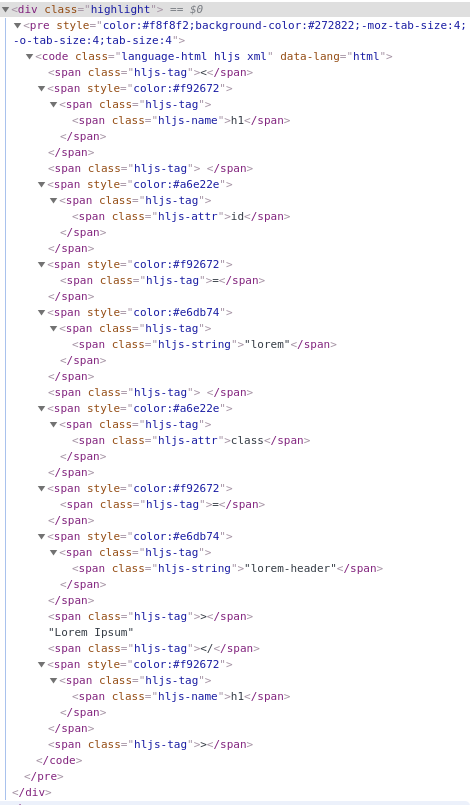

### Relevant files
  
1. config.toml




1. /layouts/partials/head/highlight.html




1. /layouts/partials/footer/highlight.html





---

### Breaking things down 


Highlighting can be done by using either Hugo's built-in ``[shortcode](https://gohugo.io/content-management/syntax-highlighting/#highlight-shortcode) or using code fences in our markdown. Code fences can be enabled by setting `pygmentsCodeFences` in `config.toml` (see line 8). Additionally, when using code fences, we can set `pygmentsCodefencesGuessSyntax` to use without a language tag specified.

---

There are several ways to implement syntax highlighting for your Hugo site.

Let us take as an example the following code snippet, and look at the generated html code and output using the various options.

Markdown code:
````md
```html
<h1 id="lorem" class="lorem-header">Lorem Ipsum</h1>
```
````

HTML Output:
```html
<h1 id="lorem" class="lorem-header">Lorem Ipsum</h1>
```

---

#### Configuring highlighting

The [docs](https://gohugo.io/content-management/syntax-highlighting/#configure-syntax-highlighter) discuss the different configuration options available to us. Using the configuration settings in different combinations give us a few different ways to implement highlighting.

#### Option 1 

The easiest, in my opinion, is to simply set both `pygmentsUseClassic` and `pygmentsUseClasses` to false. The first configures Hugo to use Chroma instead of Pygments, and the second inlines the styles, removing the need to generate a CSS file. These are the settings configured for this site.

##### Output:









---

#### Option 2

You could also choose to use CSS files that [Hugo can generate for you](https://gohugo.io/content-management/syntax-highlighting/#generate-syntax-highlighter-css) by running the following:

```sh
# hugo gen chromastyles [...] 
# see docs for options
hugo gen chromastyles --style monokai > 'static/chroma-monokai.css'
```
and using these settings:

```toml
pygmentsUseClassic = false  
pygmentsUseClasses = true
```

Un-comment the lines in the partials that load the generated css file.

- /layouts/partials/header/css.html
  - Line 2 (`<!-- -->`)

##### Output:









---

#### Option 3

You can also use client-side highlighting, for example using [highlight.js](https://highlightjs.org/). 

To test this, un-comment the lines in the partials that load highlight.js

- /layouts/partials/header/css.html
  - Line 1 (`<!-- -->`)
- /layouts/partials/footer.html
  - Line 1 (`/* */`)


##### Output:









